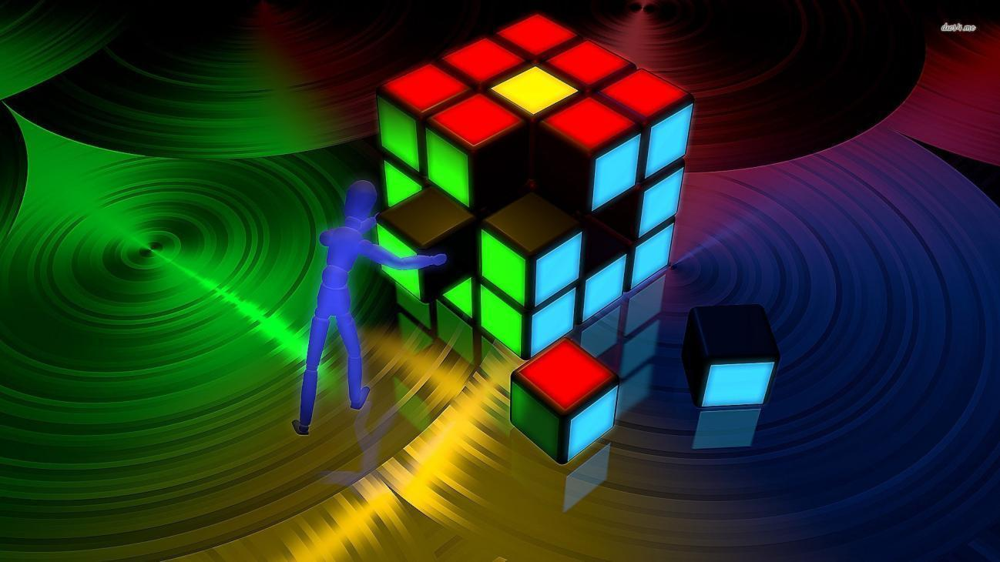
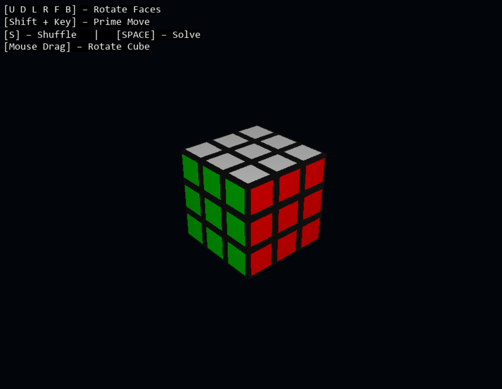

<p align="center">
  
</p>

<h1 align="center">◼️Cube Cracker</h1>
<p align="center">
<strong>An interactive 3D Rubik's Cube simulator built with Python, Pygame, and OpenGL.</strong>
</p>

<p align="center">
  
  
  
  
</p>

## Overview

Cube Cracker is a desktop Rubik's Cube visualization project. It renders a 3D cube made of individual cubelets, lets the user rotate the camera with the mouse, turn cube faces with keyboard controls, shuffle the cube, and play back a solution based on the recorded move history.

The project is useful as a compact study of 3D rendering, spatial transformations, event-driven input, and cube-state modeling in Python.

## Features

- Real-time 3D Rubik's Cube rendering with OpenGL.
- Pygame window, icon, keyboard input, mouse input, and text overlay.
- 27 cubelet-based model with colored face stickers.
- Standard face rotations for `U`, `D`, `L`, `R`, `F`, and `B`.
- Prime moves using `Shift + face key`.
- Mouse-drag camera rotation for inspecting the cube.
- Shuffle command that applies 20 random moves.
- Move-history tracking for every manual or shuffle move.
- Auto-solve playback by reversing the recorded move sequence.
- On-screen control instructions.
- Separate cube-state and solver helper files for future extension.

## Screenshot

<p align="center">
  
</p>

## Technology Stack

| Area | Technology |
| --- | --- |
| Language | Python |
| Window and Events | Pygame |
| 3D Rendering | PyOpenGL |
| Text Overlay | `pygame.freetype` |
| Cube Logic | Python dictionaries and coordinate transforms |
| Optional Solver Helper | `magiccube` in `solver.py` |

## Project Structure

```text
cube-cracker/
├── README.md
├── LICENSE
├── main.py
├── cube.py
├── solver.py
├── banner.jpg
├── icon.png
└── screenshot.png
```

## Installation

### Prerequisites

- Python 3.10 or newer
- `pip`

### 1. Open the Project Folder

```bash
cd cube-cracker
```

### 2. Install Required Packages

```bash
pip install pygame PyOpenGL PyOpenGL_accelerate
```

If you want to experiment with `solver.py`, also install:

```bash
pip install magiccube
```

### 3. Run the Application

```bash
python main.py
```

On some systems, use:

```bash
python3 main.py
```

## Controls

| Action | Input |
| --- | --- |
| Rotate upper face | `U` |
| Rotate down face | `D` |
| Rotate left face | `L` |
| Rotate right face | `R` |
| Rotate front face | `F` |
| Rotate back face | `B` |
| Prime / inverse face move | `Shift + U/D/L/R/F/B` |
| Shuffle cube | `S` |
| Play solve sequence | `Space` |
| Rotate camera | Mouse drag |
| Quit | Close window |

## How It Works

Cube Cracker represents the Rubik's Cube as a dictionary of cubelets. Each cubelet is stored by its 3D coordinate `(x, y, z)`, where each axis value is one of `-1`, `0`, or `1`. Visible stickers are stored as face labels such as `U`, `D`, `F`, `B`, `L`, and `R`.

When a face is rotated, the program:

1. Selects all cubelets on the target layer.
2. Rotates their 3D positions around the correct axis.
3. Rotates each cubelet's face directions so the sticker orientation remains consistent.
4. Rebuilds the cubelet dictionary with the new positions and faces.

This approach mirrors the mathematical idea of a Rubik's Cube as a set of discrete cubies transformed by quarter-turn permutations.

## Known Limitations

- The solve feature is currently move-history based, not a full optimal solver.
- `cube.py` contains scaffold methods for future cube operations.
- `solver.py` is not integrated into the main application loop yet.
- There is no packaged executable or requirements file at the moment.

## License

This project is licensed under the MIT License. See [LICENSE](LICENSE) for details.

## Author

Ashish Kumar

## Credits

This project utilizes open-source resources and media. Special thanks to the creators:

**Banner Artwork** - Sourced via online wallpaper archives ([dusk4.me](http://dusk4.me) digital catalog reference).

**Rubik's Cube Concept** - Originally invented by Ernő Rubik.
